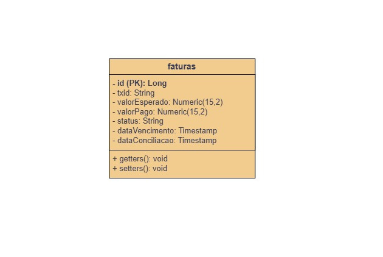
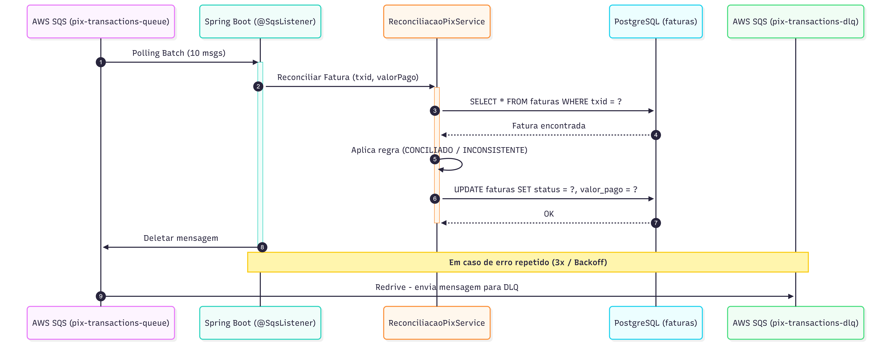
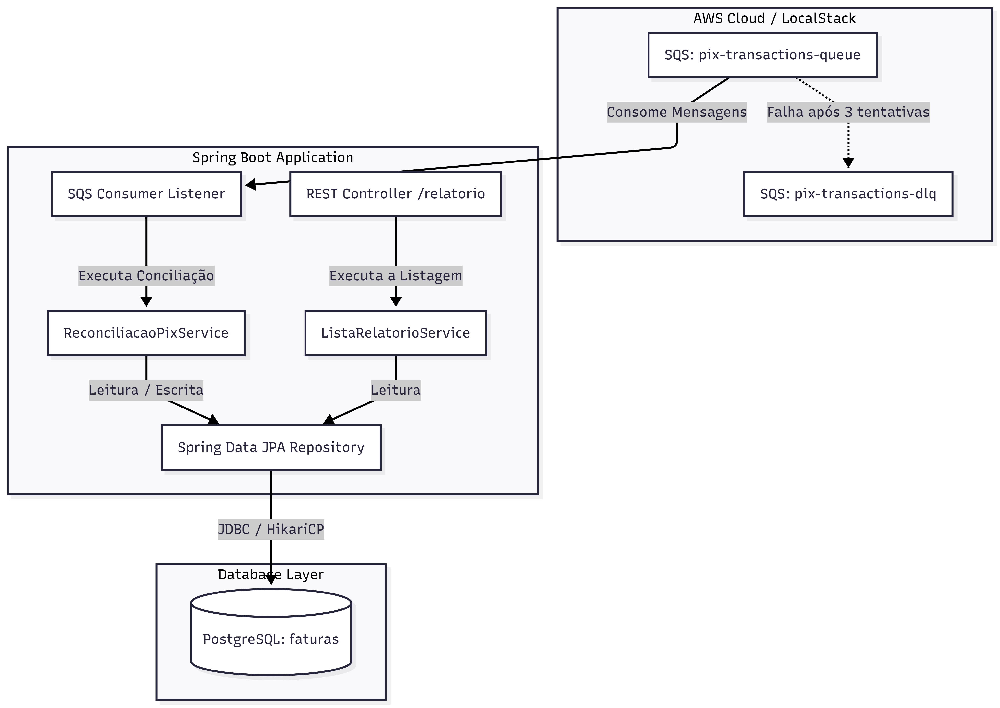
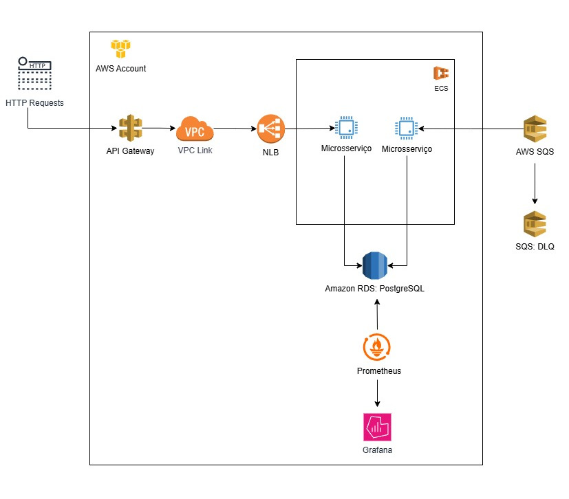

# Sistema de Reconciliação Automática de Pagamentos Pix 

API de alta performance e resiliência projetado para processar cargas de transações financeiras.


---

## Arquitetura e Design de Software

O desenho do sistema foi planejado para isolar a complexidade do negócio das ferramentas tecnológicas, facilitando a escalabilidade e a manutenção.

* **Arquitetura em Camadas:** Organização interna bem definida (Domínio, Aplicação e Infraestrutura) para separar responsabilidades técnicas de regras de negócio.
* **Microsserviços**: Facilitar a manutenção e a escalabilidade.
* **Domain-Driven Design (DDD):** Lógica de negócio centralizada no coração do sistema (domínio).

---

## Modelo de Dados e Persistência

* **PostgreSQL:**  (Dimensionado na nuvem para suportar picos).
* **Vazão do Desafio:** Ingestão contínua de **2.000 mensagens por segundo**.
*  **Índice**: Na tabela (faturas) para buscar o TXID mais rápido e menos custoso (B-three)
* **Interface Visual Local:** pgAdmin.

### Diagrama de classes UML



---

## Estratégia para Alta Volumetria e Resiliência

Para suportar a carga de 2.000 m/s sem gargalos ou degradação do ambiente:

* **Configuração de Threads (Spring Cloud AWS):** Calibragem do listener SQS com concorrência dinâmica (`concurrency: 20-50`) e consumo máximo por chamada (`max-messages-per-poll: 10`) para esvaziar a fila em paralelo.
* **Ajuste de Connection Pooling (HikariCP):** Sincronizado com o pool de threads (`maximum-pool-size: 50`), garantindo que cada thread ativa tenha uma conexão direta e instantânea com o banco, evitando gargalos de I/O.
* **Dead Letter Queue (DLQ):** Isolamento de mensagens corrompidas ou com erros crônicos na fila `pix-transactions-dlq` para investigação, permitindo o posterior reprocessamento (*Redrive* para a fila principal).
* **Retries:** Mecanismo automático de até 3 tentativas (`max-attempts: 3`) antes de descartar a mensagem para a DLQ.
* **Backoff/Jitter:** Em caso de falhas temporárias (como instabilidade no banco), o sistema aguarda um tempo progressivo (VisibilityTimeout: 30 adicionado na fila) e com ruído aleatório (Jitter) para reprocessar, evitando o efeito de "manada".
* **Connection Batch:** Processamento em lote (50) para enviá-las juntas ao servidor em uma única comunicação de rede.

---

## Estratégia de testes

* **Abordagem:** Test-Driven Development (TDD) focado no comportamento do domínio.
* **Tipos:** Unitários e Integração.
* **Ferramentas:** JUnit 5 e Mockito.

---

## Logging 

* **Mecanismo:** SLF4J com Logback (`log.info`/`log.warn`/`log.error`).
* **MDC (Mapped Diagnostic Context):** Rastrear o ciclo de vida completo de uma mensagem específica (adicionado no listener).

---

## Observabilidade e Production Ready

* **Métricas:** Prometheus alimentado via Spring Boot Actuator e Micrometer.
* **Kubernetes Probes:** Endpoints nativos de saúde e prontidão configurados.
* **Métricas em Texto:** `http://localhost:8080/actuator/prometheus`
* **Health Check:** `http://localhost:8080/actuator/health/liveness`
* **Interface Prometheus Local:** `http://localhost:9090` *(Dica: Use a query `process_cpu_usage` para avaliar a CPU sob estresse)*.

---

## Princípios SOLID & Design Patterns

### SOLID
* **S (Single Responsibility):** Classes com responsabilidade única (ex: SQS Consumer apenas consome, Service apenas aplica regra de negócio).
* **O (Open/Closed):** Arquitetura baseada em microsserviços permite estender o ecossistema adicionando novos serviços sem modificar o código existente.
* **L (Liskov Substitution):** Herança e polimorfismo do Java, garantindo que as implementações de interfaces (como contratos de repositórios).
* **I (Interface Segregation):** Interfaces de domínio enxutas.
* **D (Dependency Inversion):** interface que serve ao seu modelo de domínio (Ex: public interface FaturaRepository extends JpaRepository<Fatura, Long>).

### Design Patterns
* **Builder:** Criação de entidades e DTOs de forma imutável e legível.
* **Singleton:** Escopo padrão dos Beans gerenciados pelo Spring Framework (Services, Repositories).
* **Observer:** Notificar os eventos no sistema (Fila SQS).
* **Proxy:**  O Spring cria um objeto de disfarce ao redor da classe "processarReconciliacao" para controlar o acesso.

---
### Diagrama de Sequência


---

### Diagrama C4 Model


---

## Proposta de Nuvem e CI/CD

### Pipeline e Estratégia de Deploy
Automação via **GitHub Actions** integrada ao **AWS CodeDeploy**. 

### Diagrama para Deploy em Produção (AWS)



---

## Como Executar 

### Pré-requisitos
* Git
* Docker e Docker Compose instalados

### Passo a Passo
1. Clone o repositório:
   ```
   git clone <url-do-repositorio>
2. Navegue até a raiz do projeto:
    ```
   cd <nome-do-projeto>
3. Renomei o arquivo
    ```
    ".env.example" para ".env"
4. Rode no console:
    ```
   docker-compose up -d --build
   
## Links
* O projeto irá rodar em: http://localhost:8080
* Documentação Swagger: http://localhost:8080/swagger-ui/index.html

## Relatório 
* **URL:** `/api/v1/relatorio`
* **Método:** `GET`

#### Exemplo de Resposta (`200 OK`):

```json
[
  {
    "id": 9007199254740991,
    "txid": "TXID-1",
    "status": "CONCILIADO",
    "valorPago": 150.00,
    "motivoInconsistencia": null,
    "dataVencimento": "2026-08-03T19:06:10.766968",
    "dataConciliacao": "2026-07-31T23:48:43.714Z"
  },
  {
    "id": 9007199254740992,
    "txid": "TXID-2",
    "status": "INCONSISTENTE",
    "valorPago": 100.00,
    "motivoInconsistencia": "Valor pago R$ 150.00 é divergente do valor esperado R$ 100.00",
    "dataVencimento": "2026-08-03T19:06:10.766968",
    "dataConciliacao": "2026-07-31T23:49:10.120Z"
  },
  {
    "id": 9007199254740993,
    "txid": "TXID-3",
    "status": "PENDENTE",
    "valorPago": 0.0,
    "motivoInconsistencia": null,
    "dataVencimento": "2026-08-03T19:06:10.766968",
    "dataConciliacao": null
  }
]
```
## Melhorias
* **Multi-stage Build no Dockerfile**: Otimizar a imagem Docker para compilar o código.
* **Grafana**: Consolidar as métricas do Prometheus.
